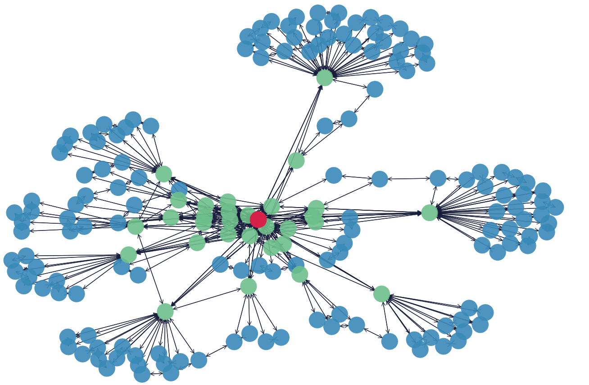

# FluidModel
An fluid model for VNE embedding in 5G networks

## About the project 

Virtual Network Embedding (VNE) is strongly NP-hard. Given the practical importance of the problem, heuristics and exact solutions have been extensively studied. In this project, we explore two typical application network topologies: a chain and a tree. We propose a novel heuristic based on an LP model that exploits properties of the 5G domain and cloud native virtualization. In contrast to the traditional approach that makes placement decisions and link embedding for each individual Virtual Network Function (VNF), our model is fluid. We embed aggregate application traffic of multiple users, making decisions on the fraction of user connections sent through different alternative forwarding paths. While aggregate user traffic is treated as splittable flow, each individual user traffic is not splitted. 

## Dependencies
In order to run the optimization model, we use the Gurubi optimization solver [1] with the interface to Python 3.8. In order to use Gurobi, it is needed first to get the license. In our case, we have used the Gurobi Academic license. After having the Gurobi license, the following python packages are needed to be installed.
```
$ pip install gurobipy
$ pip install numpy
$ pip install pandas
$ pip install networkx  \\[minimum 2.6.2]
$ pip install seaborn
```

After having Python and Gurobi environment ready, the Network Config (network_config.py) file can be used to change parameter value of the netwrok, application, and user values.

## About the 5G Network topology
For the network topology generation, we have used the 5GEN MEC topology generator [2]. We have generated three topologies for small, medium, and big networks that are fixed and can be loaded by declaring it in the network_config.py file. In case you want to generate new topologies, we have also added another feature to our code, which uses the same strategy of [2] to generate flexible topologies. Below represents an example of a medium-sized network.



## Cite our work
If you use repo in your work, please consider citing our article:
TODO 

## References
[1] https://www.gurobi.com/downloads/?campaignid=2027425882&adgroupid=77414946611&creative=406173548636&keyword=gurobi&matchtype=e&gclid=CjwKCAjw8sCRBhA6EiwA6_IF4T1GiXPxRiBRkbzDdO7oE-bsfG2cUCjJQmY6f3-KG0qrTdWo6roCmxoCQigQAvD_BwE

[2] https://github.com/MartinPJorge/mec-generator

